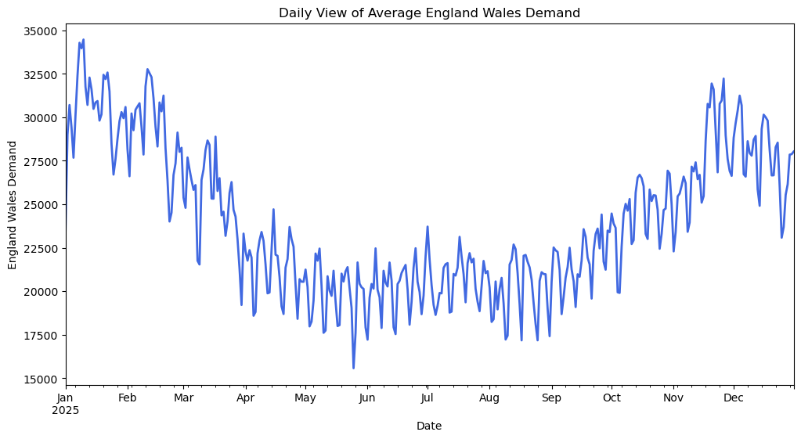
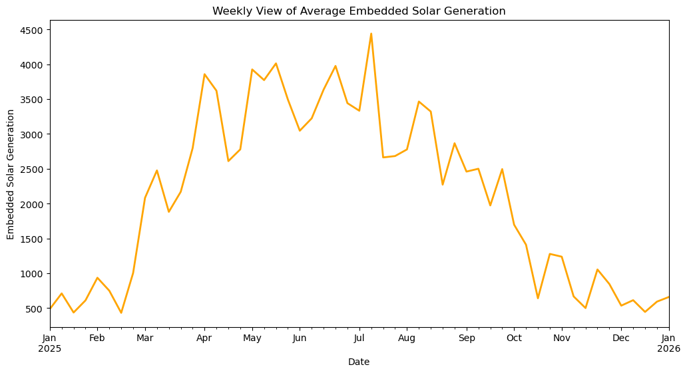
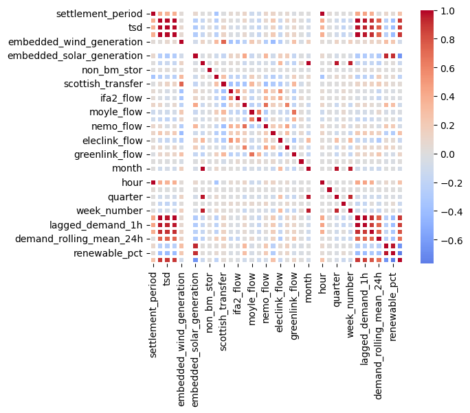
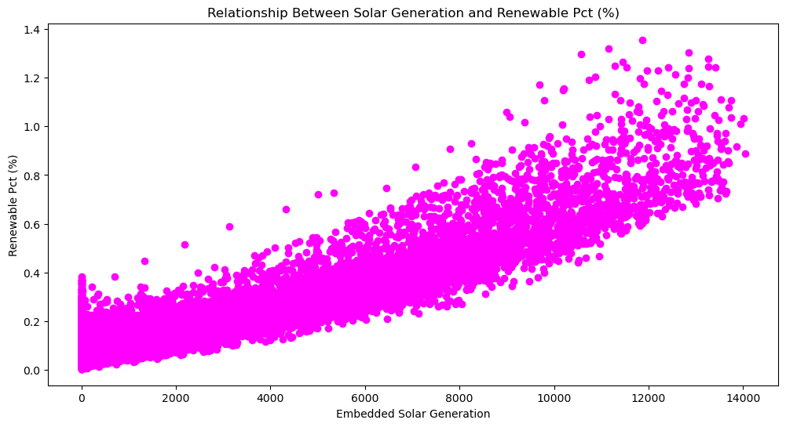

# GB-Power-Market-Demand-Forecasting

## Overview

This project analyses Great Britain's electricity demand using half hourly electricity system data from the National Energy System Operator (NESO).

The aim is to explore demand patterns, understand the impact of renewable generation and market variables, engineer predictive features and develop machine learning models capable of forecasting future electricity demand.

The project follows an end to end data science workflow, from data cleaning and exploratory analysis through to feature engineering, model development and evaluation.

---

## Business Problem

Accurate electricity demand forecasting is essential for participants in the GB power market.

Reliable forecasts help support:

- Day ahead electricity trading
- Generation scheduling
- Grid balancing
- Renewable energy integration
- Capacity planning
- Electricity market analysis

Improved demand forecasts can reduce operational costs while improving grid stability and energy efficiency.

---

## Dataset

**Source**

National Energy System Operator (NESO)

**Dataset**

Historic Half Hourly Electricity Demand Data

**Coverage**

2025

**Frequency**

30 minute intervals

---

## Project Workflow

```
Data Collection
      ↓
Data Cleaning
      ↓
Exploratory Data Analysis
      ↓
Feature Engineering
      ↓
Time Series Analysis
      ↓
Machine Learning Models
      ↓
Model Evaluation
```

---

## Technologies

### Programming

- Python

### Libraries

- Pandas
- NumPy
- Matplotlib
- Seaborn
- Scikit-Learn
- XGBoost

---

## Exploratory Data Analysis

The exploratory analysis investigates:

- Daily electricity demand profiles
- Seasonal demand variation
- Weekly consumption patterns
- Demand distributions
- Correlation between variables
- Renewable generation trends

### Example Visualisations

#### Daily Demand Profile



---

#### Average Weekly Solar Generation



---

#### Correlation Heatmap



---

#### Relationship Between Solar Generation and Renewable Percentage



---

## Feature Engineering

Features created include:

- Hour of day
- Day of week
- Month
- Weekend indicator
- Lag demand variables
- Rolling averages
- Renewable generation variables

---

## Machine Learning Models

Models evaluated:

- Linear Regression
- Logistic Regression
- SVM
- Decision Tree Classifier
- Random Forest Regressor
- Random Forest Classifier
- Gradient Boosting Regressor
- XGBoost Regressor
- XGBoost Classifier

Model performance was evaluated using:

- Accuracy
- F1 Score

---

## Results

Key findings include:

- Electricity demand follows clear daily and seasonal cycles.
- Winter periods consistently exhibit higher demand than summer months.
- Renewable generation has a measurable impact on system demand.
- Time based features are among the strongest predictors.
- Tree based machine learning models outperform traditional linear models for demand forecasting.
- Solar generation is typically higher during summer months/

---

## Future Improvements

- Integrate weather data
- Include electricity price forecasts
- Develop day ahead forecasting models
- Deploy an interactive dashboard using Streamlit
- Automate data ingestion from NESO APIs

---

## Author

Developed as a data science portfolio project exploring machine learning applications within the GB electricity market.
